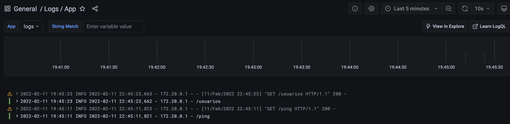

# Grafana Logs Poc

## Reqs

- Cuenta creada en https://grafana.com/
- Configurar un dashboard. Se pueden importar https://grafana.com/grafana/dashboards/13639

## Run

```bash
docker-compose build && docker-compose up
```

## Result


